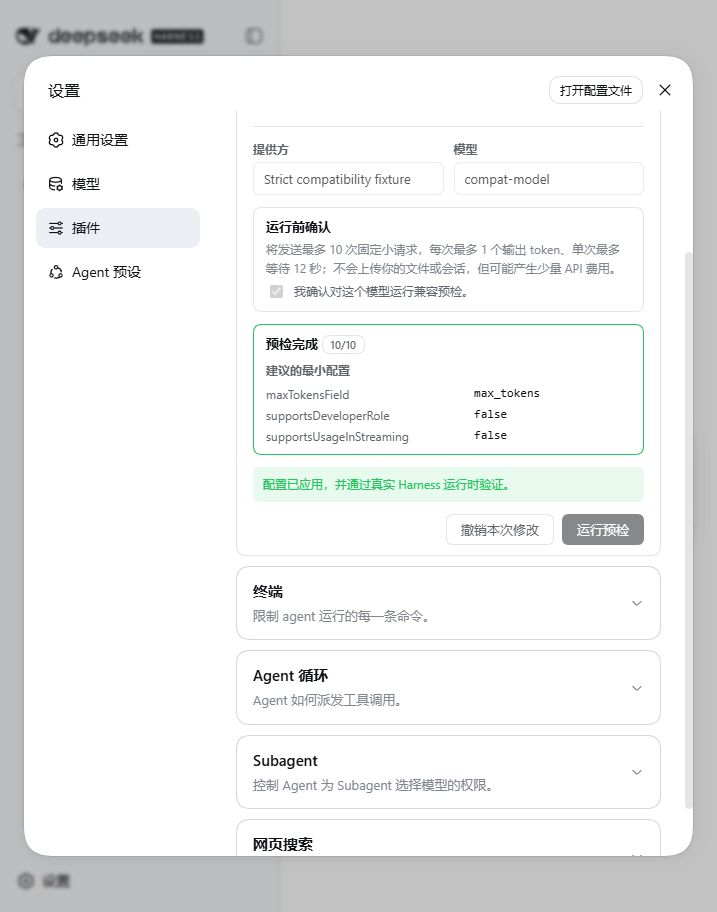

# DSH Provider Passport（提供方兼容护照）

[English](README.md)

> 公开预览版。独立社区项目，与 DeepSeek 无隶属、合作或官方背书关系。

DSH Provider Passport 用于在第一次真实任务失败之前，找出自定义 OpenAI Chat Completions 接口与 DeepSeek Harness 之间的请求方言差异。它先展示成本与隐私边界，再执行受限预检，仅生成 Harness 已支持的最小兼容配置，并通过真实 Harness LLM 运行时复验；验证失败会自动恢复原配置。



## 它解决什么问题

普通 OpenAI-compatible 连通性测试可能显示“可用”，但 Harness 仍可能因为以下请求形状被接口拒绝：

- 使用 `developer` 而不是 `system`
- 使用 `max_completion_tokens` 而不是 `max_tokens`
- 携带 `store`
- 携带 `reasoning_effort`
- 携带 `stream_options.include_usage`

Harness 已经提供相应的 `compat` 配置，缺少的是面向普通用户的闭环：发现最小配置、预览、只修改一个模型、用 Harness 自身复验，并在失败时恢复。

## 安装预览版

需要 Node.js 22.19+ 和 DeepSeek Harness Web Profile。

```powershell
npx @deepseek-ai/dsh plugin --profile web add dsh-provider-passport@preview
npx @deepseek-ai/dsh web
```

如果系统已能直接运行 `dsh`，可把命令开头的 `npx @deepseek-ai/dsh` 换成 `dsh`。

进入 **设置 → 插件**，展开 **提供方兼容护照**，选择一个自定义 OpenAI Chat Completions 模型，阅读请求预算并确认预检。

卸载：

```powershell
npx @deepseek-ai/dsh plugin --profile web remove dsh-provider-passport
```

## 安全与隐私承诺

- 不进行后台自动探测，每次都需要用户明确确认。
- 最多发送 10 次固定小请求，每次最多 1 个输出 token，单次超时 12 秒。
- 不读取用户文件、会话、提示词、工具数据或历史任务。
- 密钥与自定义请求头只在内存中使用，不进入报告和日志。
- 只给选中的模型写入实测所需的最小配置，其他模型保持不变。
- 取消不会写配置；真实 Harness 复验失败会自动恢复原配置。
- **复制脱敏报告**会移除接口地址、模型名、密钥、请求头、请求文本、响应正文和模型输出；不会自动上传任何内容。

测试企业内部接口前，请先阅读完整的[隐私设计](PRIVACY.md)。

## 帮助验证真实需求

公开预览的目的，是让使用第三方、企业代理或自托管接口的用户用自己的凭据测试，而不需要把凭据交给维护者。

1. 运行预检。
2. 点击 **复制脱敏报告**。
3. 提交一份[兼容性报告](https://github.com/ArmyWas/dsh-provider-passport/issues/new?template=compatibility-report.yml)。

请勿提交 API Key、授权请求头、完整私有地址、业务提示词或响应正文。证据标准见[测试者指南](docs/TESTER_GUIDE.md)。产品建议、疑问和无法判断的结果可发到 [GitHub Discussions](https://github.com/ArmyWas/dsh-provider-passport/discussions)。

## 当前证据

- 9 项自动测试覆盖脱敏、最小配置、取消、配置隔离和真实运行时验证。
- 同一打包插件已在发布时 npm 默认候选版 `0.1.1-rc.2` 与最新 alpha `0.1.2-alpha.4` 完成“安装 → 探测 → 应用 → 真实 Harness 复验 → 恢复”。
- 确定性严格网关复现了三类“通用检查通过、默认 Harness 请求失败”的方言差异。
- 已在真实 DSH Web UI 中人工检查设置卡片、确认、取消、应用、成功状态和回滚流程。

完整的产品发现证据见[机会报告](docs/research/opportunity-report.html)。

## 明确不重复的范围

本项目不替代通用接口测试器、模型能力探测、健康监控、路由、回退或代理适配器；通用 API、流式、工具和结构化输出测试仍应使用 [CompatCanary](https://github.com/CognizenOrg/compatcanary) 等现有工具。

本项目只负责自定义 OpenAI Chat Completions 接口与 Harness 请求方言之间的最后一公里。

## 开发与贡献

```powershell
npm test
npm pack --dry-run
```

参见 [CONTRIBUTING.md](CONTRIBUTING.md) 和 [SECURITY.md](SECURITY.md)。

## 商标与许可证

“DeepSeek Harness”仅用于真实描述兼容关系。项目名称遵循官方建议使用 `DSH` 缩写，不表示官方背书。参见上游[品牌规范](https://github.com/deepseek-ai/deepseek-harness/blob/master/BRAND_GUIDELINES.zh.md)。

MIT © ArmyWas
